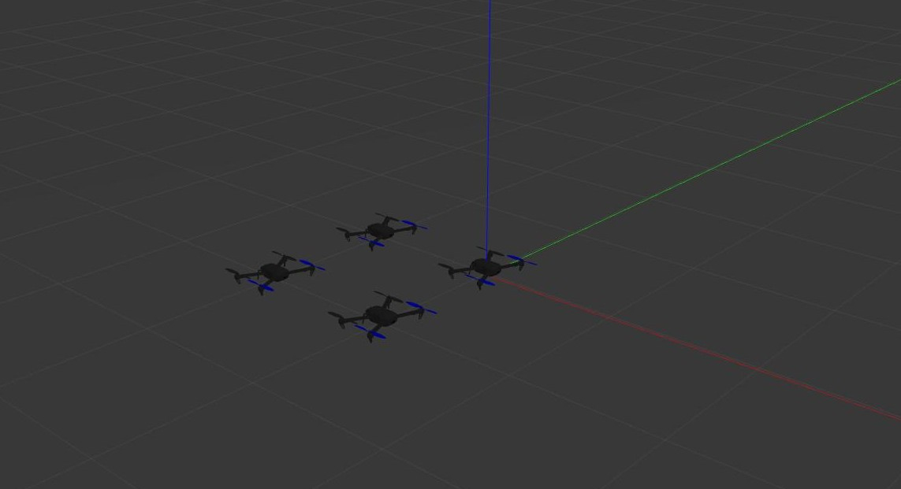

# Distributed Drone Formations

For installation and setup of PX4 SITL, ROS and MAVROS follow [this](Installation.md) link.

You can clone this package in your PX4 development workspace.
```bash
git clone https://github.com/Shobuj-Paul/nokia-formation-project.git
```

Run the simulation using the following command:
```bash
roslaunch nokia_simulation multi_drone_sim.launch
```
This launches four drones in a Gazebo environment. The launch file can be modified as per the comments given in the file to add or remove drones. You should get a scene like the following:

